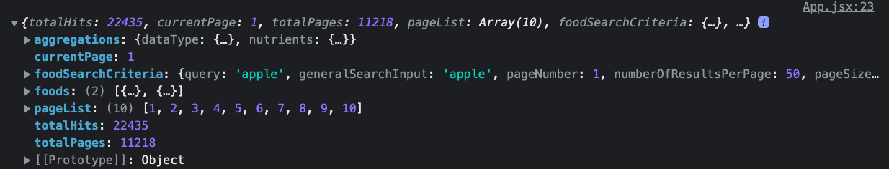
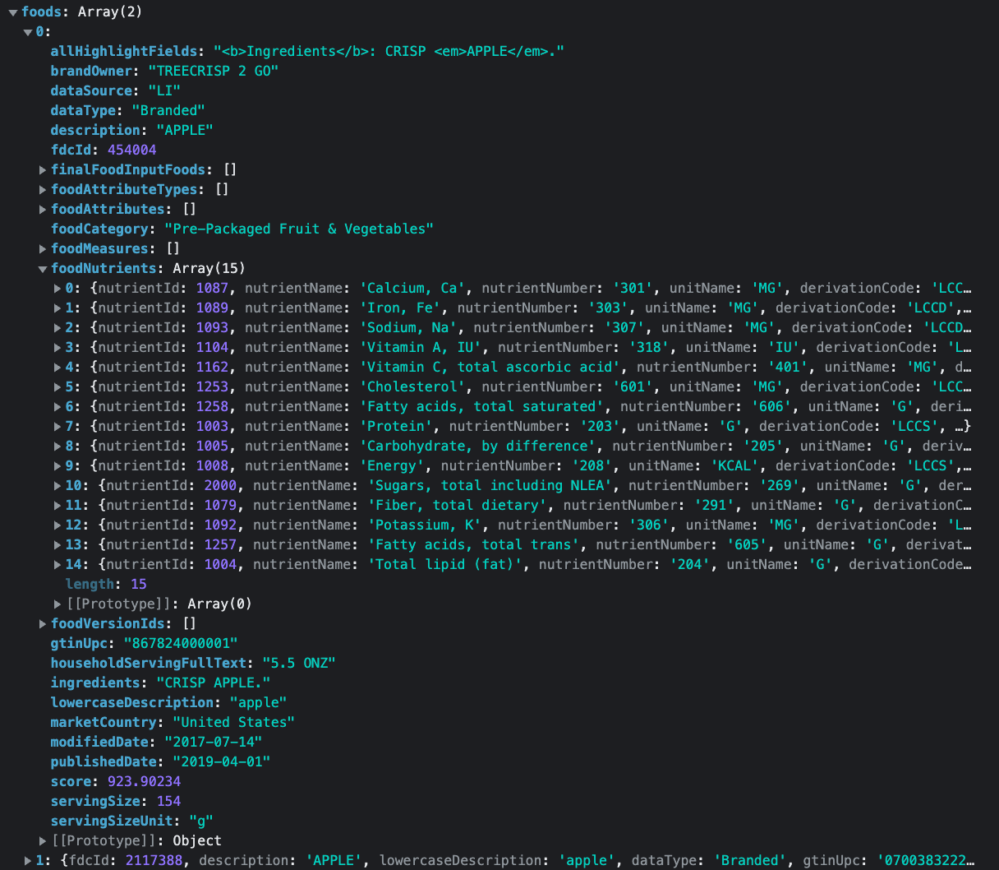
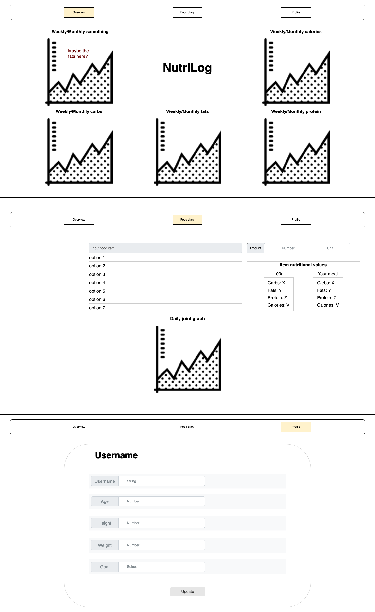

# Project planning

## Features time estimations

### Must-have -

   1. Navbar **45M**
   2. Food diary/journal/log page **Until Sunday morning**
     a. Text input (meal) **20M**
     b. Number input (amount) **30M**
     c. Make and parse API requests **2H**
     d. Present options from results **20M**
     e. handle option click **2H**
   3. Homepage with title **1H**
   4. Profile page **1H**
     a. Option to enter height, weight, age **20M**
     b. Option to choose goal (cut fat, gain muscle...) **20M**
   5. Mock identification using only username **5H**
     a. Setup MockAPI to receive information by person **45M**
     b. Send user input to API **15H**
     c. Fetch user information on login and persist **45M**
     d. Load information to all relevant components **2H**

### Nice to have -
   1. OAuth using google
      a. Find a reactive OAuth package (ZeroAuth for example) **30M**
      b. Replace mock authentication using the above **1H**
   2. Recommendations according to personal data (maybe another API) **30M-2H**
   3. Testing
      a. Research testing libraries, jest, cypress **30M**
      b. Plan first tests **45M**
      c. Implement planned tests **1H**

## Resources

APIs considered -

- https://api.nal.usda.gov/fdc/v1/
- https://nutrition-api-dev.esha.com/
- https://developer.edamam.com/

The first one was chosen after considerations for its ease of use and inclusive and suitability with the data Nutrilog is searching for.

# Design Diagram
