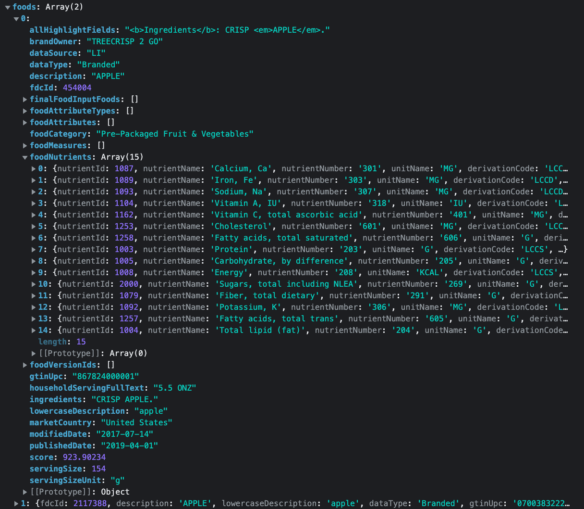

# Nutrilog

Track your macronutrients easily, just log your meals and we'll show you your intake.

## Pain / Solution

Tracking what you eat can be tedious. researching every ingredient and adding up all its nutrients. In order to cut out the most time consuming part of the process this project would give you and sum all the nutritional values.
Using the official API for nutrition by the FDA, the user can enter foods and amounts.
The app will keep track of everything entered each day and display graphs of user's progress.

## Project planning

### Features time estimations

#### Must-have -

   1. Navbar **45M**
   2. Food diary/journal/log page **Until Sunday morning**
     a. Text input (meal) **20M**
     b. Number input (amount) **30M**
     c. Make and parse API requests **2H**
     d. Present options from results **20M**
     e. handle option click **2H**
   3. Homepage with title **1H**
   4. Profile page **1H**
     a. Option to enter height, weight, age **20M**
     b. Option to choose goal (cut fat, gain muscle...) **20M**
   5. Mock identification using only username **5H**
     a. Setup MockAPI to receive information by person **45M**
     b. Send user input to API **15H**
     c. Fetch user information on login and persist **45M**
     d. Load information to all relevant components **2H**

#### Nice to have -
   1. OAuth using google
      a. Find a reactive OAuth package (ZeroAuth for example) **30M**
      b. Replace mock authentication using the above **1H**
   2. Recommendations according to personal data (maybe another API) **30M-2H**
   3. Testing
      a. Research testing libraries, jest, cypress **30M**
      b. Plan first tests **45M**
      c. Implement planned tests **1H**

### Resources

APIs considered -

- https://api.nal.usda.gov/fdc/v1/
- https://nutrition-api-dev.esha.com/
- https://developer.edamam.com/

The first one was chosen after considerations for its ease of use and inclusive and suitability with the data Nutrilog is searching for.

## Design Diagram

## Available Scripts

In the project directory, you can run:

### `npm start`

Runs the app in the development mode.\
Open [http://localhost:3000](http://localhost:3000) to view it in the browser.

The page will reload if you make edits.\
You will also see any lint errors in the console.

### `npm test`

Launches the test runner in the interactive watch mode.\
See the section about [running tests](https://facebook.github.io/create-react-app/docs/running-tests) for more information.

### `npm run build`

Builds the app for production to the `build` folder.\
It correctly bundles React in production mode and optimizes the build for the best performance.

The build is minified and the filenames include the hashes.\
Your app is ready to be deployed!

See the section about [deployment](https://facebook.github.io/create-react-app/docs/deployment) for more information.

### `npm run eject`

**Note: this is a one-way operation. Once you `eject`, you can’t go back!**

If you aren’t satisfied with the build tool and configuration choices, you can `eject` at any time. This command will remove the single build dependency from your project.

Instead, it will copy all the configuration files and the transitive dependencies (webpack, Babel, ESLint, etc) right into your project so you have full control over them. All of the commands except `eject` will still work, but they will point to the copied scripts so you can tweak them. At this point you’re on your own.

You don’t have to ever use `eject`. The curated feature set is suitable for small and middle deployments, and you shouldn’t feel obligated to use this feature. However we understand that this tool wouldn’t be useful if you couldn’t customize it when you are ready for it.
